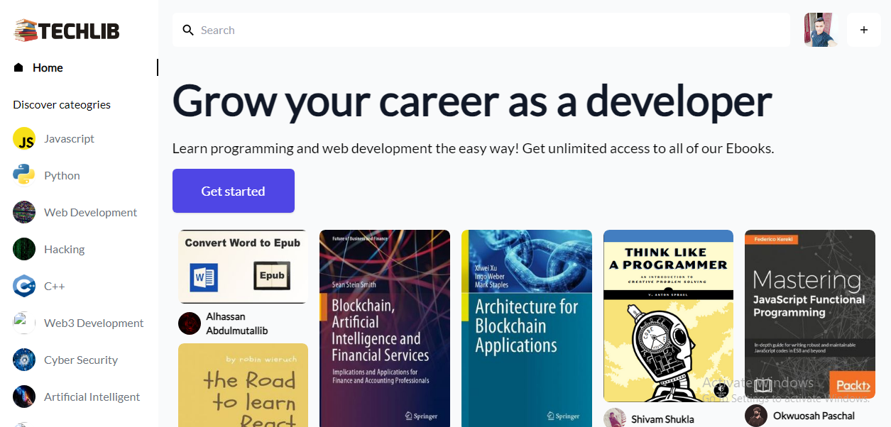

# Techlib

# 🚀 Techlib
A free e-library for developer to read and upload ebooks they would like to share with the community and help other developers grow.
 
⭐ Features
- Read Ebooks
- Upload Ebooks
- Comment your opinion about a ebook
- Like and save a Ebook to read later.

# 🌠 Stack used
- Reactjs [Frontend Framework]
- Tilwind CSS [UI Framework]
- Sanity IO [backend & database]
- Netlify [hosting]

[Learn More about techlib](youtube.com/@MohamedElbahoutyTB/videos)
